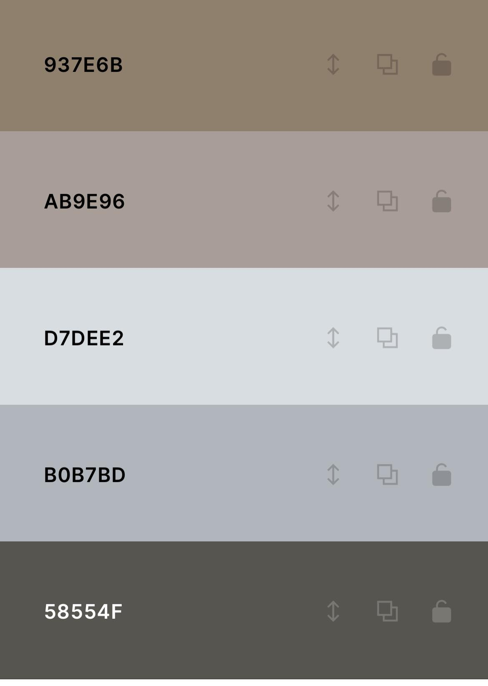

# **_Kiddy's_**
Kiddy's is a children's clothing store that uses organic cotton to guarantee the highest quality. Because our designs are distinctive, parents participate in the creation process. Our unique blend of materials, designs, and colours is what makes us who we are.

Welcome to the world of <a href="https://menna-shamloul.github.io/Kiddys" target="_blank" rel="noopener">Kiddy's</a>

# Contents
- [**_Kiddy's_**](#kiddys)
- [Contents](#contents)
- [User Experience (UX)](#user-experience-ux)
  - [Site Structure](#site-structure)
  - [Design Choices](#design-choices)
- [Features](#features)
  - [Existing Features](#existing-features)
  - [Technologies Used](#technologies-used)
  - [Testing](#testing)
    - [Validator Testing](#validator-testing)
  - [Deployment](#deployment)
    - [To deploy the project](#to-deploy-the-project)
    - [To fork the repository on GitHub](#to-fork-the-repository-on-github)
    - [To create a local clone of this project](#to-create-a-local-clone-of-this-project)
  - [Creadits](#creadits)
    - [Content](#content)
    - [Media](#media)
    - [Acknowledgements](#acknowledgements)
# User Experience (UX)
## Site Structure
Kiddy's website has four pages. The [home page](index.html) is default loading page,[about us](aboutus.html), [shop](shop.html) and [contact us](Contactus.html) pages are all accessible primarily from the navigation menu.

[Back to top](<#contents>)
## Design Choices

 * ### Typography
      The fonts chosen were 'Oswald' for the heading and 'Lato' for the body text.
     * 'Oswald' was chosen for the heading to give the user an intal good feel.
      * 'Lato' is used for the body text because it easy to read for all.
 * ### Colour Scheme 
      The colour scheme eventually chosen is one based on black and white. The colour contrasts with the cotton colour which is the main materials in my industry.
   

[Back to top](<#contents>)
# Features
Kiddy's is set up to be easy to use. It contains alot of features that the user will need such as a navigation bar and contact form. 
## Existing Features
  * ### Navigation Menu
  
    * Appear at the top of all pages in the site, it fully responsive and contains links to all page in the site to make it easy to the users.
    * The logo is clickable with a link back to home page for intensify UX.
  
  
  [Back to top](<#contents>)
  * ### Photos
  * Located on the home page beneath the logo to attract the users more to the main idea of the site which is kids fashions.
  * ### Text
  * Located under the hero photo to say wellcome to the users and to describe what is the main idea and purpose for the site.
  * ### Footer
  * Contains social media links. Make the links open in other tabs to be easy for the users.
  * The social media presence will help the users with their research into site and will attract the users to connects with Kiddy's.
* ### About-Us
  * The About Us page provide the users with the details about the site( what kids is and who we are ).
* ### Shop
  * The shop page contain our kids outfits to show the users our productus and to attract them to our site.
  * The shop page contain kids outfits photots for girls and boys.
* ### Contact Us
  * The Contact Us page provide the users with  the shop address.
  * There is Contact Us form which the users could use to contact us(for purchasing or send feedback messages).
  * It  has 4 inputs (first name, last name, email address, message).
## Technologies Used
 * HTML5- provides the content and structure for the website.
 * CSS-provides styling.
 * Codeanywhere-used to deploy the website.
 * Github-used to host and edit the website.
## Testing
 * I tested that this page works in many browsers: chrome, edge, safari.
 * I checked that this project is responsive, looks good and functions on all screen sizes using the devtools device toolbar.
 * I checked that the navigations, header, about us,texts and contact us are all readable.
 * I checked that the form works: requires entries in every field, only accept an email in the email field and the submit button works.
### Validator Testing

 * HTML
  * No errors found when passing through the official W3C validators.
  
 * CSS
  * No errors found when passing through the official (jigsaw) validators.
  
 * Accessibility
  * I checked that the colors and the fonts chosen are easy to read and accessible by running it through lighthouse in devtools.
   
## Deployment
### To deploy the project
The sit was deployed to GitHub pages. The steps to deploy;
 1. In the GitHub repository, move to the **Settings** tab.
 2. In Settings tab, move to the **Pages** tab on the left hand side.
 3. Under **Source**, select the branch to **main** then click **save**.
 4. After that the page will be automatically refreshed with detailed ribbon display to indicated the successful deployment.

###  To fork the repository on GitHub
A copy of the Github Repository can be made by forking the Github account. this copy can be viewed and changes can be made to the copy. Take the following steps to fork the Repository:

1. Log into the **Github** and locate the Repository.
2. On the right hand side of the page in line with the Repository name is a button called **Fork**, click on the Button to create a copy of the Original Repository in your Github.

### To create a local clone of this project
The method from cloning a project from GitHub:

1. Under the Repository's name, click on the **code** tab.
2. in the **Clone with HTTPS** section, click on clipboard icon to copy the URL.
3. in your IDE of choice, open **Git Bash**.
4. Change the current working directoryto the location where you want the cloned directory to be made.
5. type **git clone**,and then paste the URL copied from GitHub.
6. press**enter** and the local clone will be created.

## Creadits
### Content

* The font took from [Google fonts](https://fonts.google.com).
* The icons from [font Awesome](https://fontawesome.com/).
* The favicon from [favicon.io](https://favicon.io/).
* The color plate from [coolors.co](http://Coolors.co).
- Some codes take from the repository in [GitHub](https://github.com/Code-Institute-Solutions/love-running-v3/blob/main/7.2-styling-the-form/assets/css/style.css)

### Media

- The photos came from [Pinterest](https://www.pinterest.com) and [unsplash](https://unsplash.com)

### Acknowledgements
The website was completed as a **Portfolio 1 Project** , I would like to thank Precious Ijege, my mentor, for his assistance with my first profile project. I want to express my gratitude to David Calikes for his ongoing assistance and support.Additionally, the entire Code institute for their helpful advice and ongoing support. Without you, this project would not have been finished, thus I want to thank you all.
